# JPEG to PDF Converter – My First Dockerized System

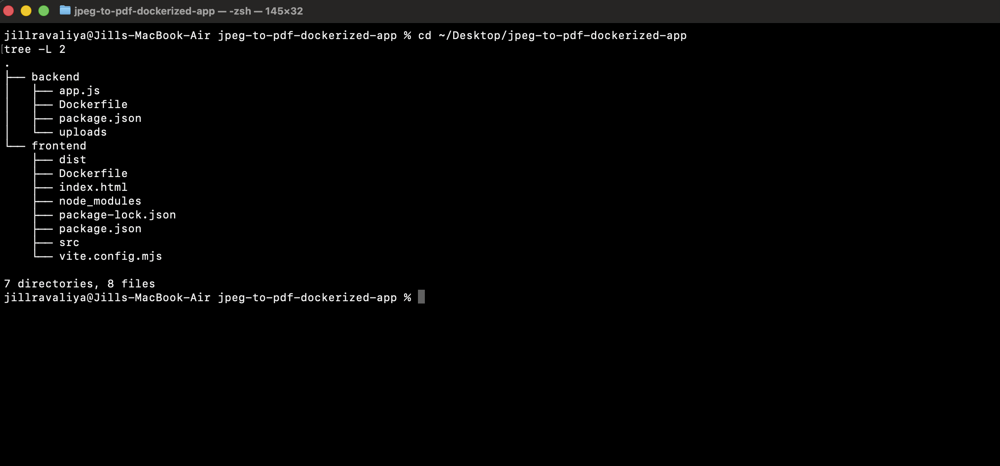

[](https://nodejs.org/)
[](https://reactjs.org/)
[](https://www.docker.com/)
[](https://www.mongodb.com/)
[](https://expressjs.com/)

---

## From "Just Code" → To Real Working Systems

I always thought building software was simple.

You write some frontend code, some backend logic, hit run, and boom — your website starts working. Right?

**I was wrong.**

When I actually tried it, I had two perfectly written apps sitting on my laptop:
- A beautiful React frontend
- A working Node.js backend

But they lived in **completely different worlds**.

The frontend couldn't find the backend.  
The backend couldn't reach MongoDB.  
And I kept getting the dreaded: *"It works on my machine."*

That's when I discovered **Docker** — and everything changed.

---

## The Problem I Faced

I wanted to build a simple app: **upload JPEG images, convert them to PDF**.

Sounds easy, right? Just write the code and run it.

But reality hit hard:
- **Port conflicts** everywhere (port 3000 already allocated)
- **MongoDB connection errors** (`ENOTFOUND mongo`)
- **Frontend white screens** after build
- **CORS errors** blocking API calls
- **"Works on my machine"** but fails everywhere else

I realized something important:

> **Code that only works on your laptop isn't software — it's an accident.**

I needed to understand how to:
- Package logic properly
- Isolate environments
- Make systems reproducible
- Connect services reliably

That's what led to this project.

---

## What I Built

### Core Features
- Upload multiple JPEG images at once
- Merge them into a single PDF document
- Download the converted PDF file
- Fully Dockerized backend and frontend
- Services communicate over Docker bridge network
- MongoDB stores upload metadata

### Architecture

```
Frontend (React + Vite + Nginx)
Port: 5173
   |
   |  →  HTTP POST /convert
   |
Backend (Node.js + Express + PDFKit)
Port: 3000
   |
   |  →  MongoDB (uploads metadata)
   |
PDF Output (/app/uploads/output_timestamp.pdf)
```


Three isolated containers, one bridge network (`jpeg-net`), working as a single system.

---

## The Journey – Step by Step

### Step 1: The Starting Point

First, I set up the project structure:

```bash
cd ~/Desktop/jpeg-to-pdf-dockerized-app
git init
git add .
git commit -m "Initial commit"
```


I organized everything into clean folders: `backend/`, `frontend/`, and separate Dockerfiles.

---

### Step 2: Creating the Docker Network

Docker containers need a way to talk to each other. That's where **bridge networks** come in.

```bash
docker network create jpeg-net
docker network ls
```

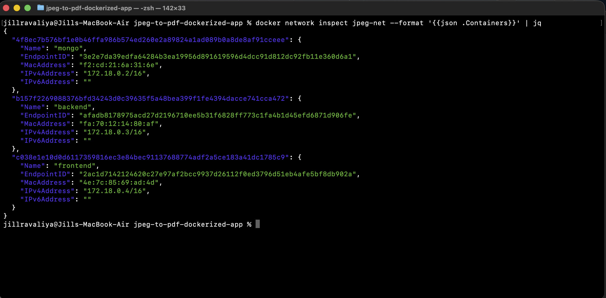

This network became the backbone of communication between frontend, backend, and database.

---

### Step 3: Setting Up MongoDB

Before building anything, I needed a database for storing upload metadata.

```bash
docker run -d --name mongo --network jpeg-net mongo
docker ps
docker logs mongo --tail=20
```

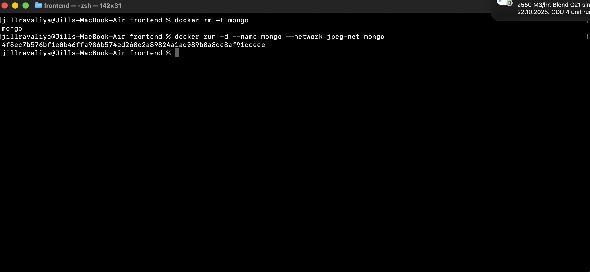

MongoDB started successfully and connected to `jpeg-net`.

---

### Step 4: Building the Backend

This was the heart of the system — where images get converted to PDFs.

#### Backend Tech Stack:
- **Node.js 18** (Alpine)
- **Express.js 4.18.2** - Web framework
- **Multer 1.4.5** - File upload handling
- **PDFKit 0.13.0** - PDF generation
- **Mongoose 7.0.3** - MongoDB ODM
- **CORS 2.8.5** - Cross-origin requests

#### The Dockerfile:

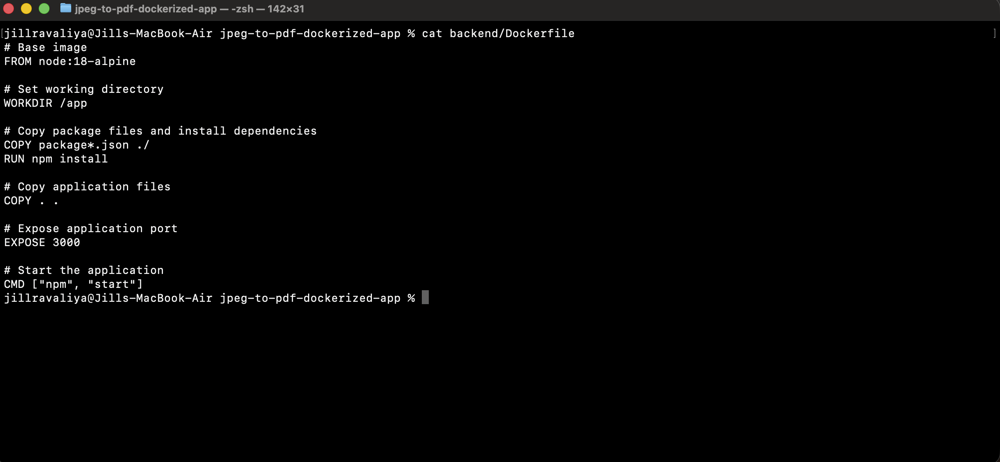

I created a multi-stage Dockerfile to keep the image lightweight.

#### Building and Running:

```bash
cd backend
docker build -t jpeg-backend .
docker run -d --name backend --network jpeg-net -p 3000:3000 jpeg-backend
```


Then I checked if everything was working:

```bash
docker ps
docker logs backend --tail=50
```

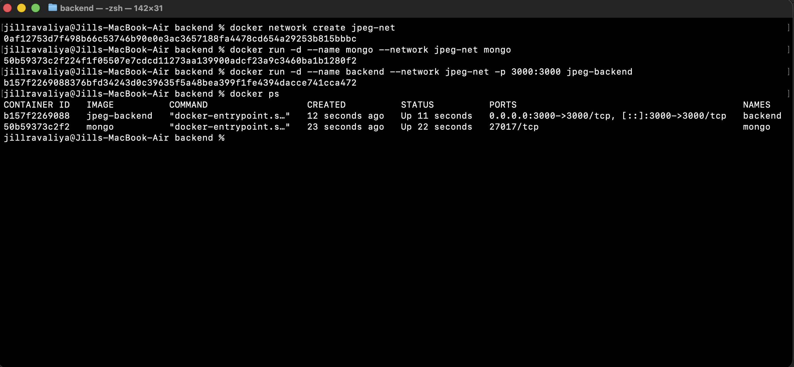

Backend connected to MongoDB successfully!

#### Testing the Backend:

I tested the API endpoint directly:

```bash
curl -X POST http://localhost:3000/convert
```

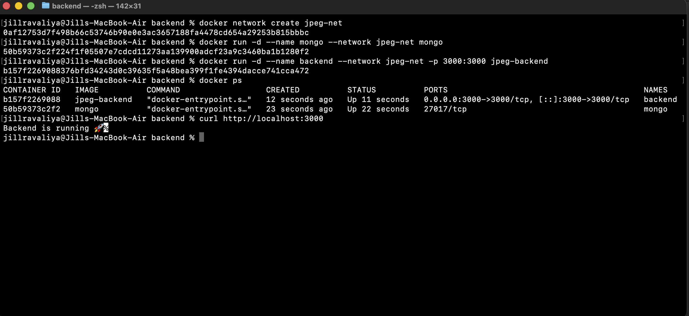

Perfect! The backend was responding.

---

### Step 5: Building the Frontend

Now came the tricky part — getting React + Vite to work inside Docker and connect to the backend.

#### Frontend Tech Stack:
- **React 19.2.0** - UI library
- **Vite 6.4.1** - Build tool
- **Nginx** - Production web server

#### The Challenge:

I hit multiple walls here:
- `Error [ERR_REQUIRE_ESM]` - ES Module issues
- `Cannot find module '@vitejs/plugin-react'`
- White screen after build (dist folder not updating)
- CORS errors when calling backend

#### The Solution:

I fixed the `vite.config.js` to handle ES modules properly:

```javascript
import { defineConfig } from 'vite';
import react from '@vitejs/plugin-react';

export default defineConfig({
  plugins: [react()],
  server: {
    host: '0.0.0.0',
    port: 5173
  }
});
```

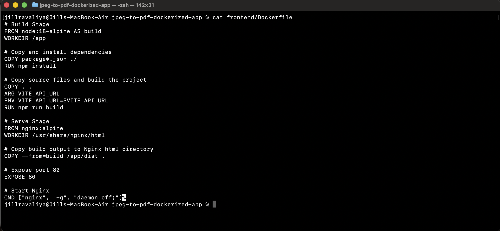

#### Building and Running:

```bash
cd frontend
docker build --build-arg VITE_API_URL=http://localhost:3000 -t jpeg-frontend .
docker run -d --name frontend --network jpeg-net -p 5173:80 jpeg-frontend
```

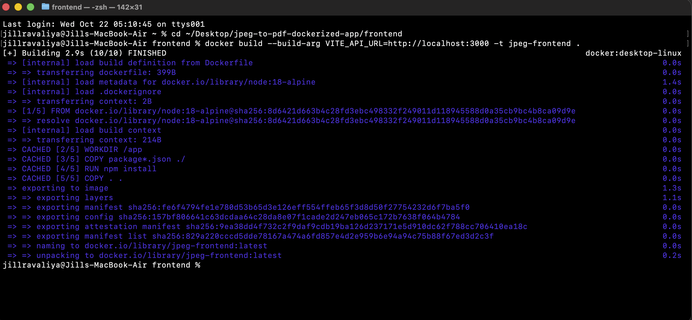

The build succeeded!


I checked if the container was running:

```bash
docker ps
docker logs frontend --tail=20
```

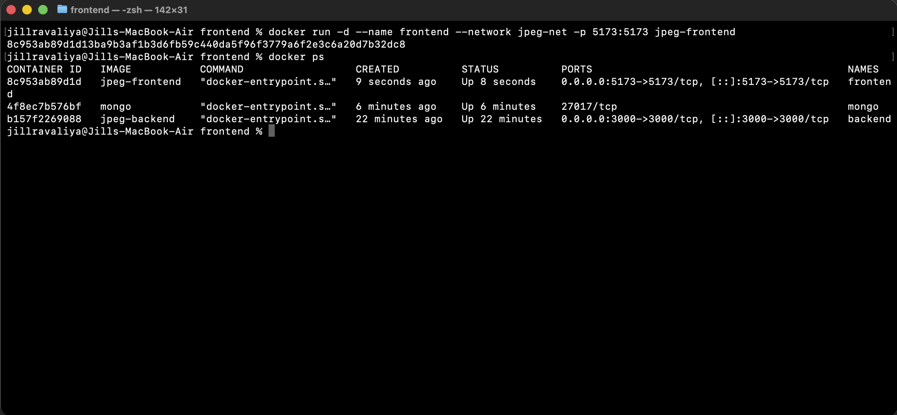

Nginx serving the React build successfully!

---

### Step 6: The Final Connection

All three containers were now running on the same network:

```bash
docker ps
```


I opened my browser and navigated to `http://localhost:5173`.

For the first time, everything worked together:
- Frontend loaded 
- Backend connected 
- MongoDB storing data 

I uploaded a few JPEG images...

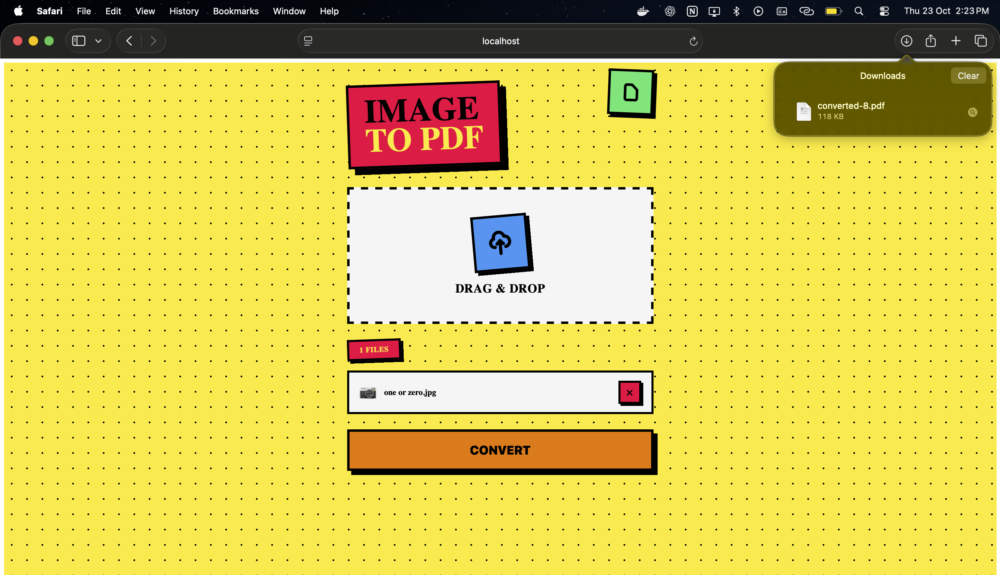

**The download prompt appeared.**

`converted.pdf` saved to my computer.

That moment — no manual setup, no environment drift — just pure isolated, reproducible logic.

---

## Problems I Faced (and Solved)

Every error taught me something. Here are the key ones:

| Problem | Solution |
|---------|----------|
| **Old containers mixed from previous projects** | `docker ps -a` → `docker rm -f $(docker ps -aq)` |
| **MongoDB not reachable (`ENOTFOUND mongo`)** | Created bridge network: `docker network create jpeg-net` |
| **Port conflict (3000 already allocated)** | Found running container: `docker ps` → `docker rm -f <container_id>` |
| **Frontend white screen (build issue)** | Fixed vite config → `docker build --no-cache` |
| **Backend failed to start** | Checked logs: `docker logs backend --tail=50` |
| **Check if PDF file was created** | `docker exec -it backend sh` → `ls -lh /app/uploads` |
| **Frontend serving blank page** | `docker exec -it frontend sh` → verified `/usr/share/nginx/html` |
| **Git push rejection** | `git pull origin main --allow-unrelated-histories` |
| **Inspect network linkage** | `docker network inspect jpeg-net` |

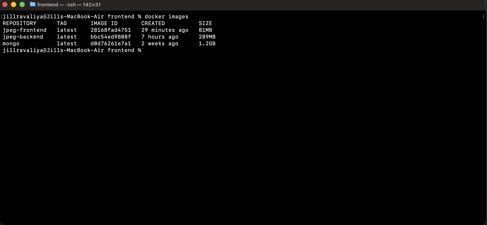

---

## What I Learned

### 1. Docker is About Discipline, Not Deployment

Docker forced me to think clearly:
- What belongs where?
- What depends on what?
- How do services communicate?

It's not just a deployment tool — it's a mindset shift.

### 2. Containers Are Like Chemical Units

In chemical engineering, you design process units that each have one clear purpose, connected through defined pipelines.

Docker works the same way:
- Frontend = UI unit
- Backend = Logic unit
- Database = Storage unit

They interact only through defined interfaces (APIs, networks).

### 3. Logs Tell Stories

Every failed build, every error message was a breadcrumb:
- Missing ESM imports
- Mongo connection failures
- Port conflicts

They weren't noise — they were lessons.

### 4. "Works on My Machine" Isn't Success

Real systems need to be:
- **Reproducible** - works everywhere the same way
- **Isolated** - dependencies don't conflict
- **Portable** - runs on any machine with Docker

---

## Tech Stack Summary

### Backend
- **Runtime**: Node.js 18 (Alpine)
- **Framework**: Express.js 4.18.2
- **Database**: MongoDB (Latest)
- **File Handling**: Multer 1.4.5
- **PDF Generation**: PDFKit 0.13.0
- **DB Driver**: Mongoose 7.0.3

### Frontend
- **UI Library**: React 19.2.0
- **Build Tool**: Vite 6.4.1
- **Dev Plugin**: @vitejs/plugin-react 5.0.4
- **Web Server**: Nginx (Production)

### DevOps
- **Containerization**: Docker
- **Networking**: Docker Bridge Network
- **Architecture**: Microservices (3 containers)

---

## How to Run This Project

### Prerequisites
- Docker installed on your machine
- Basic terminal knowledge

### Step 1: Clone the Repository

```bash
git clone https://github.com/jillravaliya/jpeg-to-pdf-dockerized-app.git
cd jpeg-to-pdf-dockerized-app
```

### Step 2: Create Docker Network

```bash
docker network create jpeg-net
```

### Step 3: Run MongoDB

```bash
docker run -d --name mongo --network jpeg-net mongo
```

### Step 4: Build and Run Backend

```bash
cd backend
docker build -t jpeg-backend .
docker run -d --name backend --network jpeg-net -p 3000:3000 jpeg-backend
cd ..
```

### Step 5: Build and Run Frontend

```bash
cd frontend
docker build --build-arg VITE_API_URL=http://localhost:3000 -t jpeg-frontend .
docker run -d --name frontend --network jpeg-net -p 5173:80 jpeg-frontend
cd ..
```

### Step 6: Access the Application

Open your browser and go to:
```
http://localhost:5173
```

Upload JPEG images and download your PDF! 

---

## Cleanup Commands

To stop and remove all containers:

```bash
docker rm -f frontend backend mongo
docker network rm jpeg-net
```

To remove all Docker images:

```bash
docker system prune -a
```

---

## What's Next

This is **Project 1** — I learned how to manually containerize and connect services.

But right now, this only works **locally on my laptop**.

**Next Step:**  
My next project will use **Docker Compose** to orchestrate all these containers with one command, then deploy it to the **cloud** to make it accessible from anywhere.

**My Goal:**  
To build and run a **real working website** — from writing code, to containerizing it, to hosting it live on the internet.

Because now I understand:

> **Running code locally isn't the end. It's just the beginning of understanding how systems really live.**

---

## Connect With Me  

I’m actively learning, building, and seeking opportunities in **network engineering** and **cloud infrastructure**.  

- Email: **jillahir9999@gmail.com**  
- LinkedIn: [linkedin.com/in/jill-ravaliya-684a98264](https://linkedin.com/in/jill-ravaliya-684a98264)  
- GitHub: [github.com/jillravaliya](https://github.com/jillravaliya)  

**Open to:**  
- Entry-to-mid-level network engineering roles  
- Cloud infrastructure opportunities  
- Mentorship & collaboration  
- Professional networking  

---

### ⭐ If this project helped you understand Docker, give it a star!

---

*Built with curiosity, debugged with patience, containerized with Docker.*
